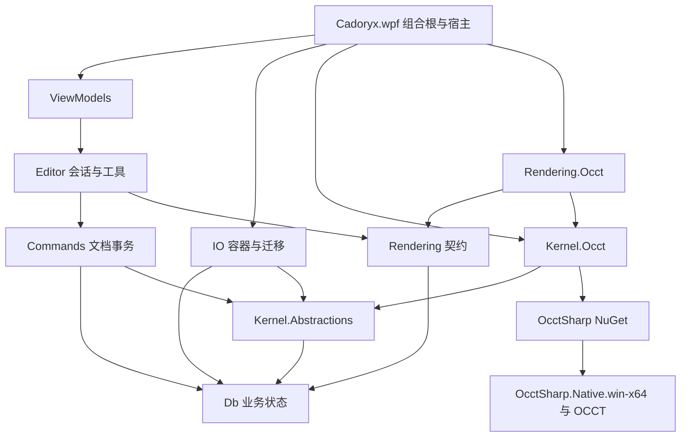

# Cadoryx 整体架构

## 1. 产品方向与设计决策

目标是可持续增加建模能力的桌面 3D CAD：先跑通模型导入、选择、属性、直接编辑、撤销和保存，再实现草图驱动的参数化零件与装配管理。

确定采用以下边界：

1. WPF 负责 Windows 窗口和输入；CommunityToolkit.Mvvm 负责界面状态；AvalonDock 负责停靠与文档标签。
2. `CadDocument` 是业务聚合根。业务元数据、装配结构、建模意图由 Cadoryx 管理；不可变几何资产保存精确结果。两者共同构成文档的持久状态。
3. OcctSharp 是几何内核与 OCCT Viewer 的唯一接入路径，使用 NuGet。Cadoryx 不链接旁边 OcctSharp 工程、不复制生成绑定、不自行新增 OCCT P/Invoke。
4. 零件定义与装配实例分离；相同零件的多个实例共享几何，通过实例路径区分。
5. 文档命令与编辑器命令分离；预览和鼠标移动不写正式文档历史。
6. 核心层使用自己的双精度数值、强类型 ID 和不可变快照，不引用 WPF、AvalonDock、OcctSharp 或原生句柄。
7. 不建立两套都能独立修改的特征图 / 撤销栈。OcctSharp 的 OCAF/XDE/ParametricDocument 是适配器内部的交换或计算上下文，Cadoryx 控制业务提交和用户历史。
8. 只在能力已验证后启用对应 UI；存在原始绑定不等于已有可交付的交互建模功能。

本轮采用单进程、模块化桌面应用。插件化、远程服务、协同编辑和 CAD 图纸工程化分别在出现真实需求后设计。

## 2. 三个仓库的现状依据

2026-09-11 建立参考基线，2026-09-12 已按以下项目结构实施：

| 仓库 | 当前已看到的内容 | 对 Cadoryx 的意义 |
|---|---|---|
| Cadoryx | 14 个项目，保留 WPF、主题/语言/设置与停靠布局，新增八个核心项目及测试项目 | 组合根注册全局内核/资产仓，每文档显式持有会话 |
| Cadoryx | 文件/历史命令路由到活动文档，树/属性由快照投影，HwndHost 承载真实 OCCT Viewer | 已跑通基础建模、交换、存储与多文档生命周期 |
| Direct2dCad | Db、Commands、Editor、ChangeTracking、Rendering、IO 等层；独立文档/编辑器命令；分节版本化存储 | 借鉴职责和交互流程，不照搬 2D Entity 继承体系 |
| OcctSharp | .NET 10、Windows x64；Shape/XDE/Viewer/Parametric 友好 API；模块包与门面包 | 使用适配器封装并明确所有权和线程边界 |

当前 Cadoryx 目录未检测到 Git 仓库；本轮不初始化仓库、不修改两个参考仓库。

## 3. 项目布局

保持已有根目录下 `Cadoryx.*` 命名方式。以下模块已创建；表中预算、恢复、完整编辑器命令等扩展职责仍需按路线逐项实施。

| 项目 | 职责 | 允许依赖 |
|---|---|---|
| `Cadoryx.Db` | ID、数值、文档快照、定义/实例、体、资产引用、领域验证 | BCL |
| `Cadoryx.Kernel.Abstractions` | 几何计算、交换、结果资产、能力与诊断契约 | Db |
| `Cadoryx.Kernel.Occt` | OcctSharp NuGet、Shape/XDE 适配、几何资产、数值与单位转换 | Kernel.Abstractions、Db、OcctSharp |
| `Cadoryx.Commands` | 文档命令、准备/提交、撤销记录和批量策略 | Db、Kernel.Abstractions |
| `Cadoryx.Editor` | 每文档会话、选中集、工具状态机、预览、任务协调、编辑器命令 | Commands、Db、Kernel.Abstractions、Rendering |
| `Cadoryx.Rendering` | 场景差量、相机/选取/宿主能力契约，无 UI 类型 | Db |
| `Cadoryx.Rendering.Occt` | Viewer、Presentation 缓存、选取映射、OCCT 导航 | Rendering、Kernel.Occt |
| `Cadoryx.IO` | 容器、DTO、迁移、资产归档、恢复 | Db、Kernel.Abstractions |
| `Cadoryx.ViewModels`（已有） | 工作区、文档、树、属性、工具面板的可观察投影 | Editor、ViewModels.Services |
| `Cadoryx.ViewModels.Services`（已有） | 文件对话框、UI 调度、消息、应用设置等平台服务契约 | BCL |
| `Cadoryx.wpf.Controls`（已有） | WPF 通用控件；不放文档业务和原生内核 | WPF |
| `Cadoryx.wpf`（已有） | 组合根、窗口、HwndHost、对话框、DI 注册 | ViewModels、IO、Kernel.Occt、Rendering.Occt、Controls |
| `Cadoryx.Lang`（已有） | 本地化资源 | 当前资源依赖 |
| `Cadoryx.*.Tests` | 领域、命令、IO、内核集成与 UI 验收 | 对应项目 |

当前 Commands 与 Editor 已独立成项目，分别承载候选编辑/重算和会话提交/历史/保存点。工具参数与预览协调当前位于 CadDocumentViewModel；后续多个前端共用工具时再提取 Editor 工具服务。实际类名、源码入口与完成边界见[实施说明](IMPLEMENTATION.md)。



箭头表示编译依赖。内核适配器向上返回纯数据和资产引用；UI 不从程序集依赖之外“顺便”取得 `Shape` 或 `XdeLabel`。

## 4. 与 Direct2dCad 的对应关系

| Direct2dCad 概念 | Cadoryx 对应 | 3D 调整 |
|---|---|---|
| CadDocument | CadDocument / DocumentSnapshot | 增加定义图、精确几何资产、特征与结果版本 |
| BlockDefinition / BlockReference | Part/Assembly Definition / ComponentSlot | 定义图为 DAG；选择使用从根出发的完整路径 |
| 2D Entity | Body、Sketch、Datum、Annotation | Face/Edge 是体的子拓扑，通常不是顶级业务实体 |
| Layer / ByLayer | Layer / AppearanceBinding | 作为组织和外观机制，不能代替装配所有权 |
| ICadCommand | 文档命令 | 慢速内核计算需要准备阶段、代际检查和原子提交 |
| ICadEditorCommand | 编辑器命令 | 相机、选择、工具切换独立于模型历史 |
| DirtySet | DocumentChangeSet / SceneDelta | 同时区分定义几何、实例位姿、外观、子拓扑失效 |
| CadCanvas / Direct2D | ViewportHost / OCCT Viewer | OCCT OpenGL、线程亲和、HWND airspace |
| `.d2cad` 分节版本 | `.cadoryx` 清单与分节迁移 | 增加 BRep/网格二进制资产与内核兼容性 |

不直接引用 Direct2dCad 项目。可复用的交互经验、命令约定和布局思路通过 Cadoryx 自己的实现表达。

## 5. 窗口与工作区

```text
┌ 标题 / 文件 / 快捷保存撤销 / 主题语言 ─────────────────────────┐
├ Ribbon：文件｜模型｜草图｜装配｜检查｜视图 ─────────────────────┤
│ 模型树 / 图层  │ 文档标签：零件 A、装配 B             │ 属性    │
│               ├ 视图工具条（独立 WPF 行）───────────┤ 建模任务│
│ 定义/特征模式  │                                    │ 参数输入│
│ 装配实例模式   │        OCCT 原生三维视口            │ 确认取消│
│               │                                    │        │
├───────────────┴────────────────────────────────────┴────────┤
│ 消息 / 命令行 / 建模诊断 / 后台任务                           │
├ 状态：工具提示｜选择｜坐标｜单位｜捕捉｜任务状态 ───────────────┤
```

- `MainWindowViewModel` 负责工作区、活动文档和全局命令路由；不持有 `OcctViewer`、模型 Shape 或所有文档的编辑细节。
- 每个标签绑定 `CadDocumentViewModel`，关联一个 `CadDocumentSession`。同一文档未来可有多个 `ViewportSession`，共享模型状态和文档历史，分别持有相机。
- 模型树是快照投影，不是业务数据库。提供“装配实例树”和“零件特征树”两种视角；可延迟展开、虚拟化，树节点使用业务 ID/实例路径，不以显示名称寻址。
- 属性面板按“文档、定义、实例、体、面/边、草图、特征”选择上下文展示。实例位置和零件尺寸分组；修改共享定义前显示受影响实例数。
- 建模任务面板有输入、验证、预览、确认、取消；Esc 取消当前预览，Enter 在可提交时确认。预览采用本次工具参数快照，与最终命令使用同一参数模型。
- 文档关闭询问由 Session 的保存点和任务状态决定。布局 JSON 只恢复工具箱和视图布局，不能还原已关闭的原生句柄或默认制造文档。
- 当前 `ViewportView` 的悬浮 Border 和根 `MaterialDesignEmbeddedDialogHost` 不能直接盖住 HwndHost。视口工具条放独立 Grid 行；确认/进度对话框用 owner Window，或在显示期间隐藏原生视口并使用冻结截图占位，关闭后恢复。普通 WPF 遮罩不能单独承担该流程。
- 浮动停靠、DPI 切换和窗口重建时，允许重建 Viewer 与 Presentation；文档和会话不随 HWND 重建丢失。

## 6. 状态、依赖注入与所有权

| 生命周期 | 服务 / 状态 | 释放者 |
|---|---|---|
| 应用级 Singleton | 设置、主题、语言、消息日志、能力目录、Workspace、内核任务调度器 | App |
| 每个文档 Session | 文档状态、命令历史、保存点、资产仓、任务令牌、编辑上下文 | Workspace.CloseAsync |
| 每个视口 | 相机、宿主句柄、Viewer、Presentation 缓存、检测高亮 | ViewportSession / WPF Host |
| 每次操作 | 输入快照、暂存资产、原生算法和临时 Shape、预览 | 操作作用域 |

不能把 DocumentSession 注册为应用 Singleton；也不能依赖普通 `AddScoped` 自动为 WPF 文档创建作用域。由文档工厂显式 `CreateScope`，关闭后 DisposeAsync。工具箱订阅活动 Session，切换时解除旧订阅；订阅回调携带 DocumentId/Generation，防止旧任务更新新文档。

`DocumentState` 是可持久化内容；`SessionState` 是选择、当前工具、临时相机、运行任务；`ApplicationSettings` 是主题/语言/最近文件；保存的 NamedView 属于文档，用户旋转相机默认不改文档。

## 7. 线程与执行模型

首版采用两个明确的执行通道：

- UI Dispatcher：所有文档提交与用户历史操作，以及 Viewer / Presentation 创建、更新、选取、重绘和销毁。
- 内核队列：首先使用一个全局串行 worker 执行建模/交换；避免尚未验证的 OCCT 全局交换配置并发和同一 Shape 并发访问。任务接收不可变托管快照和独立输入，产生独立结果。

worker 不读取实时可变文档，不调用 Viewer，不把有父对象约束的 XdeLabel 传给 UI。M1 可在 worker 产出 BRep 文件/字节和托管元数据，在 UI 侧建立专用显示形状；这是明确的安全复制边界，之后根据性能验证优化。OCCT 共享底层 TShape 的浅复制不能当作跨线程深隔离。

异步操作捕获 `(DocumentId, Generation, SessionLifetime)`，提交前逐项核对；用户关闭文档、撤销或再次编辑后，旧结果全部丢弃并释放。取消只保证在受支持的边界检查；长耗时原生调用中途不承诺立刻停止。UI 可以立即退出工具，资源清理等待调用返回。需要硬超时/崩溃隔离时再引入独立内核进程。

文档提交发布一个不可变 `DocumentChangeSet`。模型树、属性、渲染、派生统计分别消费差量。不要为每个鼠标移动或每个面发布一次全局消息；临时高亮由视口局部处理。

## 8. 性能与扩展边界

- BRep 是权威几何；三角网格、包围盒、质量属性、缩略图和 GPU 数据是按几何版本缓存的派生结果。
- 场景按“定义 + 几何版本”复用数据；实例位姿变化不重跑布尔、不改定义几何；定义变化更新所有使用它的可见实例。
- 索引维护 `Definition -> ComponentSlots`、`Body -> Assets`、`Feature -> Dependants`、`Layer -> Members`；大型模型树不一次性实例化所有面节点。
- 输入坐标、数学和 BRep 使用 double；渲染 GPU float 数据可在适配器内以局部原点转换，不能回写降精度坐标。
- 命令行、批处理、未来脚本和 AI 操作调用同一应用命令入口，不通过直接写 Db 绕过事务/校验。
- 首版不提供任意脚本执行的表达式求值器。参数表达式使用受限 AST、白名单函数和带量纲的值。
