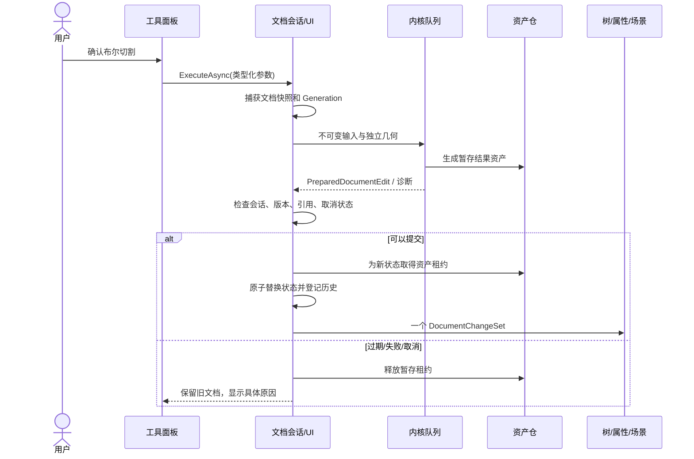

# Cadoryx 命令、事务与存储设计

本文保留目标行为，并记录当前实现。2026-09-12 已接通候选编辑、Dispatcher 提交、精确资产历史、MessagePack 文件和三格式导出；后续预算、恢复、通用迁移等目标以[路线图](ROADMAP.md)标示，接口草案不一定与当前类名逐字一致。

## 1. 三条操作路径

| 操作 | 入口 | 是否修改文档 | 撤销策略 |
|---|---|---|---|
| 新增体、布尔、移动实例、修改名称/材料、草图参数 | DocumentCommand | 是 | 文档撤销/重做 |
| 旋转相机、选择、临时隐藏、切换工作平面/工具 | EditorCommand | 默认否 | 编辑器独立历史或不记录 |
| 打开文件、另存为、导出、关闭文档 | Workspace/Application Service | 管理文档生命周期 | 不作为几何编辑命令入栈 |

“保存命名视图”是文档命令；“鼠标旋转视图”是编辑器命令。“持久隐藏对象”是文档命令；“临时隔离选择”是编辑器命令。UI 要使用不同的语义动作。

Ctrl+Z 默认撤销模型编辑，Alt+Left 等视图历史功能可另设快捷键。不能让用户刚完成切割后按十次 Ctrl+Z 才跳过相机拖动。

`MainWindowViewModel` 的 Save/Undo/Redo 路由到当前 DocumentSession。CanExecute 来自当前会话能力、历史状态与关闭状态；命令执行完才能更新成功提示。树和属性面板也只调用相同入口。

## 2. 文档命令两阶段执行

```csharp
// DTO、Snapshot、Result 均不暴露 OcctSharp 或 WPF 类型。
public interface ICadDocumentCommand
{
    string Name { get; }
    ValueTask<PreparedDocumentEdit> PrepareAsync(
        DocumentReadContext context,
        CancellationToken cancellationToken);
}

public interface ICadEditorCommand
{
    string Name { get; }
    EditorChangeSet Execute(EditorCommandContext context);
}
```

`DocumentReadContext`：DocumentSnapshot、DocumentVersion、只读资产租约、内核服务。`PreparedDocumentEdit`：ExpectedVersion、目标状态或补丁、资产暂存租约、预计算 DocumentChangeSet、诊断。它可被 Dispose，未提交则释放暂存结果。



详细约定：

1. Prepare 可在内核队列执行，不能修改当前文档或发布 UI 事件；元数据命令可以同步准备。
2. 内核输出先完成 BRep 合法性/有限值/结果数量验证，再进入可提交状态；失败返回带目标 ID 的诊断。
3. 提交运行在 Session 所属 UI Dispatcher，核对 DocumentId、Generation、会话寿命和输入修订；取消请求优先于尚未开始的提交。
4. 正式提交前完成新不可变状态、差量、历史节点和所需资产租约的准备，避免提交后才序列化几何或申请关键资源。
5. 在一个短临界区内交换状态/历史引用并递增 Generation；临界区内没有外部回调、await 或原生慢操作。
6. 提交完成后再通知订阅者。渲染或树投影失败不回滚已成功的文档，而是记录诊断并从快照重建投影。
7. 同一会话的提交串行化。首次实现对过期结果直接拒绝并允许用户重试；不要自动将依赖旧选择的布尔结果合并到新文档。
8. 完全无变化的命令不生成 StateId/历史；可重复的清空选择等也不制造噪声。

每个内核命令显式定义输入是否消耗、是否保留、输出为零是否允许。例：Cut 全部被切除可以产生“目标体删除”的有效结果，但不能被误报为导入失败或拿空 Shape 显示。

## 3. 撤销、重做和批量

```text
HistoryEntry
  EntryId / BatchId / Name / CompletedAt
  BeforeStateId / AfterStateId
  BeforeSnapshot / AfterSnapshot（不可变结构共享）
  ForwardChangeSet / ReverseChangeSet
  AssetLeases（两个状态所需的精确资产）

DocumentHistory
  UndoEntries / RedoEntries
  Settings（最大条目数、估计字节预算、批量显示策略）
```

几何操作 Undo/Redo 恢复已提交状态和资产，不重跑内核。重跑可能受内核版本、公差、运算顺序影响，也浪费时间。大体几何按资产共享，不能在每条记录里重复存完整 BRep 字节。

- Undo 恢复 BeforeStateId，Redo 恢复 AfterStateId；两者都递增 Generation，清理失效 Selection，并发布对应差量。
- Undo 后新执行编辑，释放整个 Redo 分支持有的租约；当前状态与其他历史仍引用的资产保留。
- 历史裁剪按条目和估计内存/磁盘预算同时控制；只有真正没有消费者的资产才能删除。
- 保存只更新 SavedStateId，不清空用户历史。已保存状态被历史裁掉时依然保留 SavedStateId 比较信息。
- 原生 OCAF 的内部命令仅用于候选计算上下文回滚；不得同时接受 UI Undo，使两份历史各自前进。
- 关闭/重新打开文件，首版不恢复运行时撤销栈；特征设计历史持久化，用户命令撤销历史不等于特征树。

批量支持两种业务语义：

| 批量类型 | 行为 | 适用 |
|---|---|---|
| Atomic | 全部在暂存状态准备，任一步失败不提交；一条复合历史 | 导入装配、一次变换多个实例 |
| Sequential | 子命令分别成功提交，共享 BatchId，可按步或批撤销 | 脚本、命令行连续操作 |

`UndoMode/RedoMode` 可以是应用级可变偏好，由历史弹出时读取；不能在加入批次时固定死。Atomic 已是一条记录，不能再拆成内部步骤撤销。混合“选对象→修改文档→旋转相机”的脚本分别调用编辑器和文档通道，批次关联仅用于活动日志，不强行把相机装成文档修改。

## 4. 工具状态机与预览

```text
Idle -> CollectingInput -> Validating -> PreviewPending -> PreviewReady
                            |                  |               |
                            +--> Invalid <-----+               +-> Committing -> Idle
任何可取消阶段 -> Cancelling -> Idle
```

一个 `ModelingToolSession` 拥有 ToolId、输入版本、输入参数、临时选择、错误和 PreviewLease。鼠标/数值输入递增 PreviewGeneration；只接纳最新预览结果。预览不占文档历史，不改变 IsDirty。

参数链必须一致：工具默认值 → 任务面板编辑 → 类型/单位验证 → 预览请求 → 最终命令。最终确认时检查预览使用的文档版本和参数版本；相同才可提升为正式结果，否则重新准备。不能界面看起来是 10mm，最终创建却读取另一个默认值。

退出工具、Esc、文档切换/关闭都释放预览；原生计算尚未结束时标记废弃，返回后再释放。撤销提交后的建模操作由文档历史处理，而不是恢复已销毁工具对象。

## 5. 差量更新与诊断

`DocumentChangeSet` 至少包含：

| 分类 | 字段/含义 | 下游影响 |
|---|---|---|
| Structural | Added/RemovedDefinitions、Slots、Bodies | 树结构、实例展开、Selection 校验 |
| Geometry | BodyId + Old/NewGeometryRevision | Presentation、网格/包围盒/质量缓存 |
| Placement | 所属定义和 ChangedSlotIds | 所有相关实例世界变换、场景范围 |
| Appearance | 对象/图层/材料 ID、变化通道 | 统一外观重新解析 |
| Metadata | 名称、用户属性 | 树文字、属性、文档信息 |
| Feature | Dirty/ChangedFeatureIds | 特征树、重算诊断 |
| Topology | 已删除/失效/成功映射的引用 | 标注、选择、依赖特征 |
| Settings | 单位/公差/命名视图等 | 对应 UI 和派生数据 |

差量携带 DocumentId、Before/AfterStateId、Generation；订阅者发现漏代际可以请求完整快照。批量提交先归并差量，删除优先消除同批的新增/修改噪声。大量引用定义更新时使用反向索引，不只更新当前选中的实例。

`CadDiagnostic`：稳定 Code、Severity、MessageKey/Args、ObjectTarget、OperationId、可选技术细节。日志本地化显示消息，测试断言 Code；内核异常的原始文本可写诊断详情，不能把所有错误都吞成“操作失败”。

## 6. `.cadoryx` 容器

当前实现选择 ZIP 容器 + UTF-8 JSON 清单 + MessagePack 3.1.8 结构节 + 独立 BRep/XDE 资产。MessagePack 的紧凑数值表达适合 CAD，但不取代业务版本、关系验证或内核序列化；性能收益仍需真实模型基准。使用 `[MessagePackObject]` 与显式 `[Key(n)]`，Standard resolver、UntrustedData、最大对象深度 128；禁止 Typeless/Contractless。MessagePack 压缩关闭，由 ZIP 统一压缩。

```text
model.cadoryx
├ manifest.json
├ sections/document.msgpack      # 文档身份、单位、公差、根定义
├ sections/structure.msgpack     # Part/Assembly、Slots、Bodies
├ sections/features.msgpack      # 配方、依赖、结果、空结果输出属性
├ sections/presentation.msgpack  # 图层、外观、材料
├ extensions/<index>.bin         # 未知可选节，保留原始编码和载荷
└ assets/<sha256>.bin            # BRep 或嵌入 XDE 上下文
```

以上是实际写出的目录结构。网格输入、独立 sketches/references 节、命名视图和缩略图仍未实现。XDE 上下文不是所有文档的必需项。所有被当前特征图作为 Source 输入的旧几何资产也属于“当前可达资产”，不能只保存可见 Body 的最新 BRep。

`manifest.json` 必需字段：

| 字段 | 用途 |
|---|---|
| format / containerVersion | `Cadoryx` 与 ZIP 内约定版本；与各节版本独立 |
| documentId / stateId | 文件中的文档身份与保存快照身份 |
| applicationVersion | 来源版本；时间戳和每资产内核版本记录后续补充 |
| requiredCapabilities[] | 当前必需能力；未知能力拒绝加载 |
| sections[] | kind、path、schemaVersion、encoding、required、length、sha256 |
| assets[] | id、path、length、sha256；当前编码由 BRep/XDE 引用角色确定 |

每个 section/asset 的 hash 针对未压缩载荷字节。禁止把绝对路径、XdeLabel.Entry 或进程指针当作资产路径/业务身份。Header 指格式清单摘要，不把“ZIP 没有自定义头”混同为必须实现另一个头格式。

## 7. IO API 与版本迁移

规划接口：

```text
ReadManifestAsync(path)                  # 不加载 OCCT
ReadSectionAsync<TDto>(path, kind)       # 按节版本执行迁移
ReadDocumentSettingsAsync(path)          # 设置预览
LoadAsync(path, options)                 # 验证后返回独立 LoadedDocument
SaveAsync(snapshot, assets, path)        # 只保存捕获的快照
```

容器版本、每节 SchemaVersion、资产编码版本、特征参数版本是四个不同维度。一个新草图字段不需要让每个几何资产重新编码，也不能只递增容器号而不提供节迁移。

当前读取分派严格匹配 `(schemaVersion, encoding)`：v1/json 通过旧 JSON DTO 解码，v2/messagepack 通过数字键 DTO 解码，两者转换到同一领域快照，保存统一写 v2。JSON 迁移注册器仅处理 JSON 内连续版本步骤；未来跨编码/跨节迁移需扩展注册表，不能假装已存在通用二进制迁移。字段 Key 和持久枚举编号不得重排或复用；新增字段须确定缺省语义，破坏兼容的变更提升节版本。解码后拒绝尾随字节、非法配方、未来必需节，并执行整个领域图验证。

未知版本处理：

- 新于当前能力的必需节/必需特征拒绝编辑，可在已保存结果足够时提供明确标记的只读模式。
- 未知可选节和字段保留原始载荷；若编辑使其引用或依赖可能失效，按扩展契约标记失效/禁止保真保存，不能承诺盲目复制即可语义保真。
- BRep/上下文资产先验证 hash，再由合适内核版本尝试解码；不假设 OCCT 任意跨版本都可往返。
- 迁移后默认保存到新文件或原子替换前保留旧副本；失败保留原文件。
- `ReadDocumentSettingsAsync` 只迁移 document 节；它不应该强制创建 Viewer、读取所有 BRep 或等待草图求解。

## 8. 保存、打开与恢复协议

保存步骤：

1. 在 UI 通道捕获 DocumentSnapshot / StateId，取得当前可达资产的只读租约；随后 UI 可继续编辑。
2. 在目标同目录创建唯一临时文件；写入载荷、长度/hash 和清单，关闭 ZIP 并刷新文件。
3. 重新读取验证清单、必需节、资产引用/hash；根据操作系统支持对已存在目标原子替换，新目标同卷移动完成。
4. 成功后将 SavedStateId 更新为本次捕获的 StateId。若 UI 已编辑到另一个 StateId，仍显示未保存；不能直接设置 IsDirty=false。
5. 同一文档的普通保存串行化，避免旧快照晚完成覆盖新快照。另存为成功后才更新当前路径；失败不改路径和保存点。
6. finally 释放只读租约与本次临时文件；失败不删除旧目标。网络/特殊文件系统原子性能力需检测，不能承诺完全相同的崩溃保证。

打开步骤：清单/容量检查 → DTO 解码与迁移 → 全图引用校验 → 资产校验/必要的内核解码 → 构造独立 Session → 加入 Workspace。任一步失败释放临时资源，不替换用户当前文档。

只读缩略图/文件摘要无需全模型解码。完整编辑打开可延迟加载部分几何，但必须明确未加载和已验证范围；不能把缺失资产状态显示为有效可编辑模型。

自动恢复保存到独立恢复目录和独立文件，不更新 SavedStateId、不覆盖用户文件；记录原路径、时间、DocumentId/StateId。首版恢复粒度是最近完整恢复快照。以后需要更细颗粒度再增加带校验和的日志，不把内存历史序列化成任意 CLR 对象。

容器防护属于格式实现：限制总解压大小、单条目大小、数量和嵌套深度；拒绝重复规范路径、路径穿越、同名大小写歧义与符号链接；只在受控目录提取文件；不执行附件。外部引用默认不自动访问网络。

## 9. 交换与原生保存的区别

`.cadoryx` 是设计文档，保存业务身份、参数、结构、资产和设置。STEP/IGES 是交换文件，不能承诺保留 Cadoryx 的所有特征、草图约束或命令历史。

- STEP/IGES 默认使用 XDE 读取名称、颜色、装配和受支持元数据；geometry-only 入口只用于用户明确要求仅几何的场景。
- 导入生成候选文档/候选定义子图，建立 `SourceIdentity -> Cadoryx ID` 映射后整体提交；重新导入独立源需要明确替换或新增策略。
- 导出从一致快照构建专用 XDE/Shape 上下文；导出失败不修改活动文档。
- 未映射的 PMI、样式、外部引用等记录为诊断/来源附件。附件只保留来源，不能保证编辑后仍能正确映射回目标几何。
- 输出前生成能力/信息损失报告，区分完整支持、近似、将丢弃。只有确实有信息损失需要用户决定时才要求选项；日常无损导出可按已保存偏好执行。
- 导出成功不改变 `.cadoryx` 保存点。

## 10. 验收用例

| 用例 | 必须观察到的结果 |
|---|---|
| 布尔内核抛错 | 状态/历史/资产可达关系保持原样，显示具体诊断 |
| 计算中撤销/关闭文档 | 旧结果不能提交，返回后资源释放 |
| 多实例共享零件后修改尺寸 | 所有相关实例几何更新，实例位置保留 |
| 撤销布尔后重做 | 恢复相同 GeometryRevision 和结果资产，不重跑算法 |
| 保存 S2、编辑 S3、撤销 S2 | IsDirty=false；Generation 比之前更大 |
| 保存过程中发生新编辑 | 文件保存捕获快照；当前文档仍显示未保存 |
| 改批量撤销偏好后撤销 | Sequential 批次按当前设置处理；Atomic 保持单条 |
| 修改参数的旧预览晚返回 | 不覆盖最新预览；取消不留下正式 Body |
| 文件保存中断/无磁盘空间 | 原文件可打开；没有错误更新保存点 |
| 旧版本只读取 settings | 仅迁移需要的节，不初始化 OCCT |
| 改写/缺失一个几何资产 | hash/引用检查报错，不部分加载成成功文档 |
| 未支持的未来特征 | 明确只读或拒绝编辑，不静默删除特征后保存 |
| 同名零件/重复子装配实例 | 依靠 ID/完整路径定位，树和 Viewer 选择一致 |
