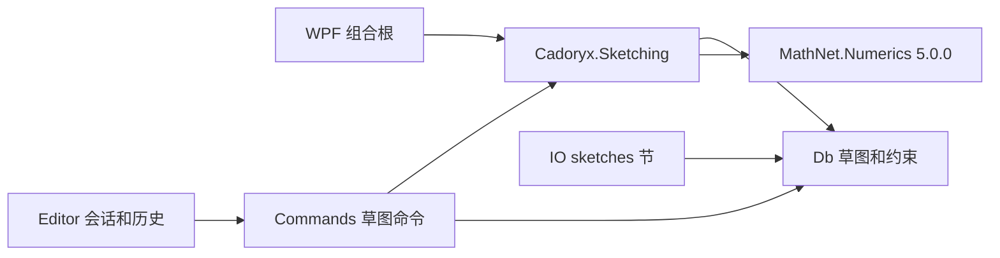

# M4-S1：草图模型与约束求解基础

后续状态：M4-S2 已接通二维编辑和关联特征重算，当前 sketches v2、features v4、applicationVersion=0.4.0。本文保留 M4-S1 阶段的基础设计、数值边界与历史验收；当前交互、修订、引用协议和使用说明见 [SKETCH_EDITOR](SKETCH_EDITOR.md)。

实施日期：2026-09-12。本阶段交付可运行的草图数据、求解器、文档命令、持久化和恢复基础。尚未提供鼠标绘制草图、约束标注界面或草图驱动的自动特征重算；这些属于 M4-S2。原有多边形输入面板仍是有限轮廓工具。

## 模块与依赖



`Cadoryx.Sketching` 是第 15 个解决方案项目，只引用 Db 和 MathNet.Numerics，不引用 WPF、OcctSharp 或内核适配器。接口为 `ISketchConstraintSolver`，默认实现 `ManagedSketchConstraintSolver`，版本标识 `cadoryx.sketch.lm-svd.1`。WPF 组合根已注册接口，其他前端也可独立使用。

MathNet 是数值运算库，约束模型、方程、迭代和诊断由 Cadoryx 实现。选用纯托管稠密 SVD，适合当前有明确上限的小草图，尚未接入大型稀疏求解或商业 CAD 求解器。NuGet 版本固定 `[5.0.0]`，直接/传递依赖锁文件已更新。

许可与部署已核实：[NuGet 5.0.0 元数据](https://api.nuget.org/v3-flatcontainer/mathnet.numerics/5.0.0/mathnet.numerics.nuspec) 声明 MIT，[对应 tag 的许可证](https://github.com/mathnet/mathnet-numerics/blob/v5.0.0/LICENSE.md) 已保存到 `licenses/MathNet.Numerics/LICENSE.md`，随 WPF 发布复制。没有添加 MKL/OpenBLAS 等 native provider 包。独立消费者实测使用 `ManagedLinearAlgebraProvider`，无需初始化 OCCT。

## 持久数据与不变量

| 类型 | 已实现语义 |
|---|---|
| CadSketch | SketchId、PartId、名称、Plane、点/线/圆/约束数组 |
| SketchEntityId | 草图内稳定实体 ID；数组位置不作为引用 |
| SketchConstraintId | 草图内稳定约束 ID；诊断返回该 ID |
| SketchPoint | 局部二维位置，mm；可标记构造点 |
| SketchLine | 通过点 ID 引用 Start/End；可标记构造线 |
| SketchCircle | 通过点 ID 引用 Center，独立半径；可标记构造圆 |
| Plane | 已有 RigidTransform3d，将局部 XY 映射到所属零件坐标；旋转必须为单位四元数 |

文档权威草图索引是 `DocumentSnapshot.Sketches`，通过 PartId 指向存在的 PartDefinition，不在 Part 中重复维护另一个可修改列表。草图、实体、约束身份非空；实体在点/线/圆之间不得重复；约束目标必须存在且类型匹配。禁用约束也保留有效引用，不能隐藏断链。拒绝零长线、非正半径、非有限坐标和错误平面。

相邻线可直接共享端点 ID，此时不需要额外 Coincident 方程。两个不同点即使坐标相同，仍是两个可独立求解的点。构造几何也参与求解和 DOF 计算，只在边界提取时排除构造线。当前暂不支持圆弧、样条、外部引用、平面面引用或关联基准。

## 支持的约束

| 类型 | 目标 | 方程数 / 单位 |
|---|---|---|
| FixPoint | 点 + 指定位置 | 2 / mm |
| Coincident | 两个点 | 2 / mm |
| Horizontal / Vertical | 一条线 | 1 / mm |
| OffsetX / OffsetY | 两个点，有方向的 B-A 偏移 | 1 / mm；允许负值或零 |
| Distance | 两点距离 | 1 / mm；正值 |
| Length | 线长度 | 1 / mm；正值 |
| Parallel / Perpendicular | 两条线 | 1 / 归一化方向叉积或点积 |
| EqualLength | 两条线 | 1 / mm |
| Radius | 圆半径 | 1 / mm；正值 |
| EqualRadius | 两个圆 | 1 / mm |

以上 13 种类型均有独立 record 和白名单存储标签，携带 IsEnabled。没有将任意字符串表达式或 CLR 类型名作为持久约束。角度尺寸、切线、点在线/圆上、参考尺寸、表达式和圆弧端点约束留待后续单独实现。

## 求解与诊断

1. 在工作线程验证输入和稠密预算，按稳定 ID 建立变量表。每点两个变量，每圆一个半径变量；线仅引用已有点，不再引入重复端点变量。
2. 平移到局部数值原点并按几何/尺寸规模缩放。用解析导数建立雅可比矩阵，长度与方向残差分别按公差归一化。
3. 仿射系统使用截断 SVD 最小二乘；含距离、长度、方向的系统使用阻尼迭代。无约束方向保留初始解附近的自由运动，不强行固定到原点。
4. 只有全部归一化残差绝对值 ≤ 1，且输出坐标反归一化后再次通过残差和领域验证，才返回可提交 Solution。退化初值、不收敛和无效输出不会冒充成功。
5. 对成功解的雅可比按行归一化，再用 SVD 秩计算局部 `DOF = VariableCount - Rank`。不按约束对象数减自由度：FixPoint 是两个方程，冗余方程不减少 DOF。

状态含义：

| Status | 含义 | 可提交 |
|---|---|---|
| UnderConstrained | 满足约束，局部 DOF > 0 | 是 |
| FullyConstrained | 满足约束，局部 DOF = 0 | 是 |
| Inconsistent | 全仿射系统经独立最小二乘复核仍不相容 | 否 |
| DidNotConverge | 非线性未收敛、奇异/退化或输出精度不足 | 否 |
| InvalidInput | 类型、引用、数值或几何非法 | 否 |
| LimitExceeded | 稠密预算或数值精度范围不支持 | 否 |

`RedundantConstraints` 单独报告局部冗余/部分冗余约束，不把“有重复约束”直接当作不可解。按稳定约束 ID 顺序逐组检查秩增量，因此它给出可解释的一组冗余项，不保证唯一。

`ConflictingConstraints` 只为已确认的仿射不相容系统提供。≤64 个约束时做删除式缩减，得到数值公差下不可再删的冲突子集；不是最少数量集合，也不保证唯一。更大系统返回完整不相容集合。非线性失败只报告残差和未收敛，不把非零残差当作数学上的无解证明。失败的 DOF/Rank 为 null；Report 不会被保存成权威状态。

默认线性公差 1e-7 mm，方向残差公差 1e-9，80 次迭代、256 变量、512 方程。可通过 SketchSolveOptions 显式传入；上限为 512 变量、1024 方程、500 次迭代。模型存储允许较大表，超过求解预算仍可读取，但不能假装已求解。`scale / LinearToleranceMm > 1e12` 会明确拒绝；取消在步骤/导数/诊断组之间检查，单次 SVD 不能中途打断。

DOF 是解附近的数值线性化结果，不保证全局解唯一，也不做所有分支枚举或奇异构型的高阶刚性分析。距离约束的不同位置分支会受初值影响。回归覆盖以 1e-5、1e-3、1 mm 为坐标尺度的距离网络和大坐标偏移；解析导数修复了有限差分在小尺寸网络上把 3 个刚体 DOF 误算为 2 的问题。

## 命令、历史与内核桥接

`UpsertSketchCommand` 先确认所属零件，再求解隔离候选。求解器只能改变点坐标和圆半径，不能替换名称、平面、身份、约束或所属零件。成功后才返回 PreparedDocumentEdit，Session 继续执行 Generation/取消/只读检查、StateId 更新和精确历史。求解失败抛出带 Report 的 SketchSolveException，状态、保存点、历史和资产均保持原样。

`RemoveSketchCommand` 删除草图；Undo/Redo 恢复精确快照，不重新求解。DocumentChangeSet 新增 ChangedSketches，供下一阶段 UI 更新使用。草图改所属零件必须另设明确移动操作，不能借更新命令隐式改归属。

`SketchProfileBuilder.Polygon` 按显式有序线 ID 提取一个闭合多边形，验证共享端点身份、构造线、重复、零长和自交。支持线的正反方向；不按距离自动合并端点，不支持孔洞或曲线轮廓。

提取后的 SketchProfile 是快照。可传入现有 ExtrudeRecipe/RevolveRecipe 和草图 Plane；本阶段不会自动将草图 ID 绑定到特征，也不会在草图尺寸改变后暗中重建已经复制的轮廓。M4-S2 将增加显式草图依赖和重算闭包。

## 六节文件协议

新增必需能力 `cadoryx.sketches.1` 与 `sketches v1/messagepack`。当前 containerVersion=1、assetCatalogVersion=1、applicationVersion=0.3.0；document/structure/features 为 v3，presentation v2，geometry/sketches v1。

document v3 与 v2 的物理字段相同，但 v3 表示文档必须有权威 sketches 表，即使为空。内置迁移 `introduce-sketch-registry` 将 document v2 原字节提升为 v3，并一次产生空 sketches v1；现有 JSON→MessagePack 和几何表迁移继续运行。已有 sketches 与旧 document v2 冲突时拒绝覆盖；v3 缺少 sketches 时拒绝加载。旧程序通过必需能力明确拒绝新版文件。

sketches 节使用显式数字 Key DTO，序列化所有点、线、圆、约束和启用标志；不持久化求解器内存、计算中状态或 DOF 报告。读取只进行协议/引用/领域验证，不重新求解或重建几何。设置读取仍只消费 document 节，损坏或未来 sketches 载荷不妨碍合法设置读取。

新增固定 `m3v-colored.cadoryx`，从 M3-V 实际五节文件冻结；验证迁移为空草图索引时稳定身份和精确几何不变。原三个 JSON/MessagePack 旧文件仍保留。快照恢复复用同一新协议。

## 验收与复现

```powershell
./scripts/verify.ps1 -PublishSmoke -WindowSmoke -RecoverySmoke
./scripts/verify-sketch.ps1 -DocumentPath artifacts/smoke-20260912-173843/sketches.cadoryx
```

自动化总计 157 项，新增 37 项：22 项求解/轮廓、6 项命令/原生桥接、9 项存储/恢复。范围包括全约束/欠约束、冗余、仿射冲突缩减、非线性多分支与奇异初值、尺度、取消/过期/求解器身份保护、全部约束 DTO、错误节、五节旧文件和恢复。

发布版诊断通过实际 WPF 会话运行求解、尺寸修改、撤销/重做、失败回滚、保存/重开，并生成 60×30×10 mm 的 OCCT 拉伸体（18,000 mm³）。这验证组合根/命令/显示链路，尚不是草图编辑 UI 验收。原有三格式导出、12 轮浮动/重停靠继续回归；真实进程强制终止后的恢复额外逐项核对草图身份、坐标及完整派生约束字段。

最终证据路径和通过结果见 [ROADMAP](ROADMAP.md)。独立 `tools/SketchProbe` 只引用 IO 与 Sketching，载入真实保存文件、重算草图、检查 managed provider、未加载 OcctSharp 和资产归零。许可证/DLL 随发布输出检查；测试不等同于全新 Windows 环境或大草图性能承诺。

## 下一阶段 M4-S2

建立二维编辑视图和点/线/圆绘制、选择、拖动、尺寸/约束面板；显示当前解的 DOF、冗余和冲突目标。贯通输入默认值、预览、确认/取消、树投影及文档切换，避免工具参数与最终创建脱节。

特征输入新增显式 SketchId/草图版本关联和轮廓选择，使尺寸变更驱动拉伸/旋转及后继布尔重算，并整体提交或失败回滚。冻结轮廓与关联草图必须在 UI 有明确区别；圆弧/切线/角度与曲线区域支持按独立验收增加。新增独立窗口使用 `mah:MetroWindow`。M4-T 的持久拓扑命名继续单列。
